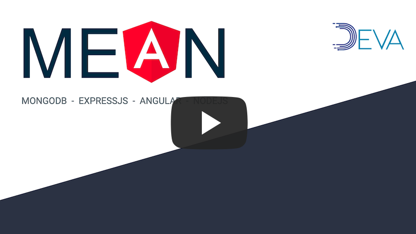

# BootCamp MEAN

Objetivo: Dominar el uso del “full stack” de desarrollo web en javascript, el framework client-side Angular, la plataforma NodeJS con el framework de “express” y el la bases de datos MongoDB

## MongoDB

Base de datos de propósito general, distribuida y basada en documentos.  
[https://www.mongodb.com](https://www.mongodb.com)

## ExpressJS

Framework de desarrollo web minimalista para NodeJS.  
[https://expressjs.com](https://expressjs.com)

## Angular

Framework de desarrollo de aplicaciones web S.P.A. (Single Page Application), orientado a componentes y con capacidad de Modelo Vista Controlador.  
[https://angular.io](https://angular.io)

## NodeJS

Entorno de tiempo de ejecución basado en el motor de Javascript "V8" de Chrome.  
[https://nodejs.org](https://nodejs.org)

### Curso completo

## Bloques

* ( 0 ) Introducción (videos 1 y 2) [->](./bloque-0-introduccion/README.md)
* ( 1 ) Desarrollo Web (videos 3, 4, 5, 6) [->](./bloque-1-web-tech/README.md)
* ( 2 ) Angular [->](./bloque-2-angular/README.md)
<!-- * ( 3 ) NodeJS & Express [->](./bloque-3-node-express/README.md) -->
<!-- * ( 4 ) MongoDB [->](./bloque-4-mongodb/README.md) -->
