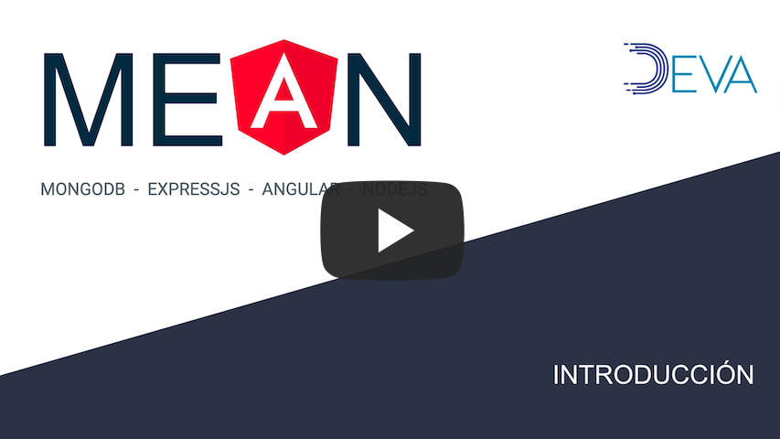

# BootCamp MEAN

## Introducción 

  
Video 1

Es recomendable que se tengan conocimientos básicos de programación, así como nociones de desarrollo web.

[Conocimiento esperados (nivel básico) ->](./conocimientos.md)

[Herramientas y programas (video 2) ->](./herramientas.md)

[<- README](../README.md)
