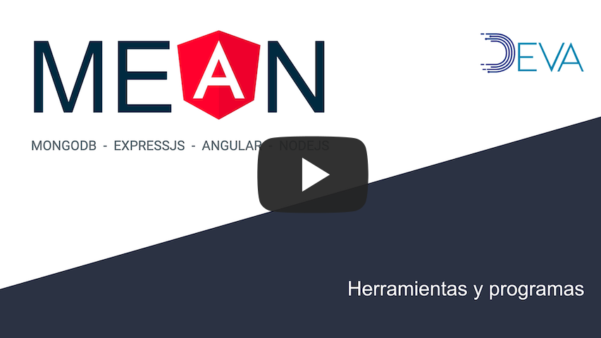

# Herramientas y programas

 Es recomendable que los siguientes programas se tengan instalados previamente y familiarizarce con los siguientes comandos y funciones.

## Git

* **git clone**
* git pull

 [APRENDER ->](https://www.tutorialspoint.com//git/index.htm)

## Editor de textos

* Archivos de texto
* Árbol de archivos y carpetas
* Búsqueda global
* Plugins (git, docker, debug, lint, etc.)
* Terminal

([VSCode](https://code.visualstudio.com) - [Atom](https://atom.io))

## Editor de textos CLI

* Commandos (shortcuts)
* open, exit, save, undo, copy, paste, etc.
* sudo

([nano](https://www.howtogeek.com/howto/42980/the-beginners-guide-to-nano-the-linux-command-line-text-editor/) - [vim](https://www.openvim.com))

## NodeJS

* npm install
* node program.js
* node ( > cli )
* nvm install
* nvm use

[NodeJs.org](https://nodejs.org/en/) + [NPM](https://www.npmjs.com/get-npm)  
ó  
[NVM](https://github.com/nvm-sh/nvm)

## Inspector

* Elementos
* Recursos
* Depurador
* Consola
* Red

Web (Chrome, Firefox, Safari, Oper, etc.)
[APRENDER ->](https://developer.mozilla.org/es/docs/Tools/Page_Inspector)

## AngularCLI

* ng new
* ng serve

[Angular.io/install-cli](https://angular.io/guide/setup-local#step-1-install-the-angular-cli)

## MongoDB

* mongod
* mongo (cliente)

[MongoDB Community Edition Install](https://docs.mongodb.com/manual/administration/install-community/)
