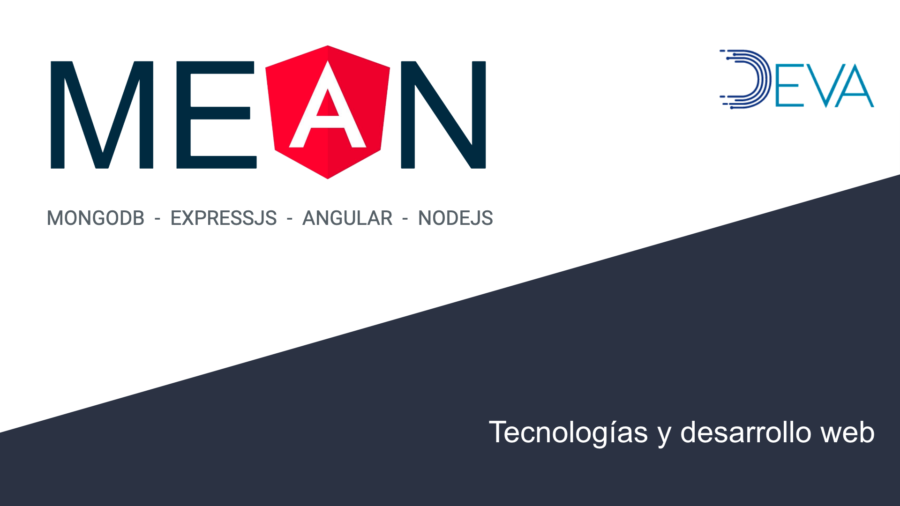
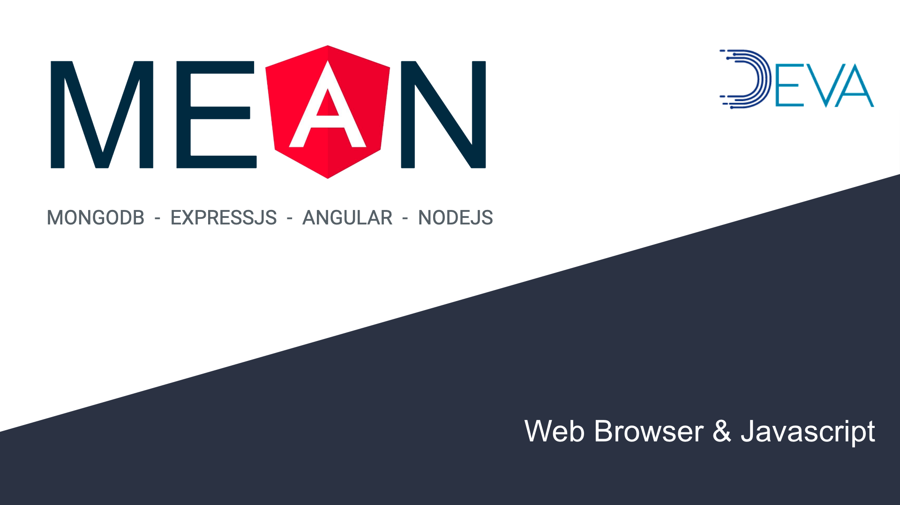
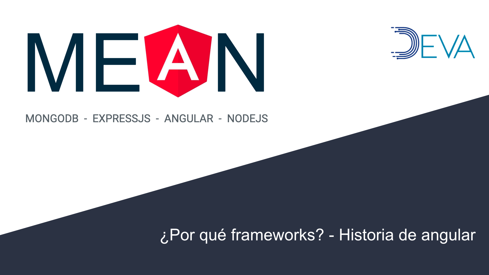

# Bloque 1

## Tecnologías y desarrollo

## Video 3

* Familia de protocolos de internet (HTTP, TCP / IP,  FTP, etc.) [->](./familia-de-protocolos-internet.md)  
* Arquitectura Cliente - Servidor [->](./arquitectura-cliente-servidor.md)

## Video 4

* Web browser y javascript básico [->](./web-broswer-js-basico.md)

## Video 5

* Javascript avanzado [->](./js-avanzado.md)

<!-- ## Video 6

* ¿Por qué frameworks? [->](./por-que-framework.md)
* jQuery, Vue.js, ReactJS & EmberJS; [->](./frameworks.md)
* AngularJS y Angular2+ [->](./angular-historia.md) -->
