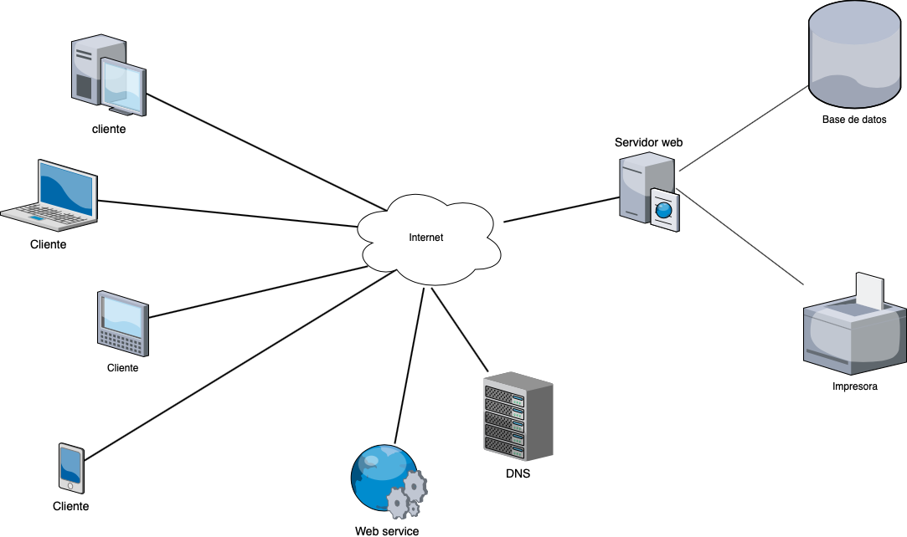

# Arquitectura Cliente Servidor

Es un modelo computacional donde existe un servidor donde se almacena, maneja y
se distribuyen la mayoría de los recursos del sistema para que los clientes
puedan consumirlos. Estos recursos serán compartidos entre los clientes.

[Referencia Techopedia](https://www.techopedia.com/definition/438/clientserver-architecture)

[<- README](./README.md)
