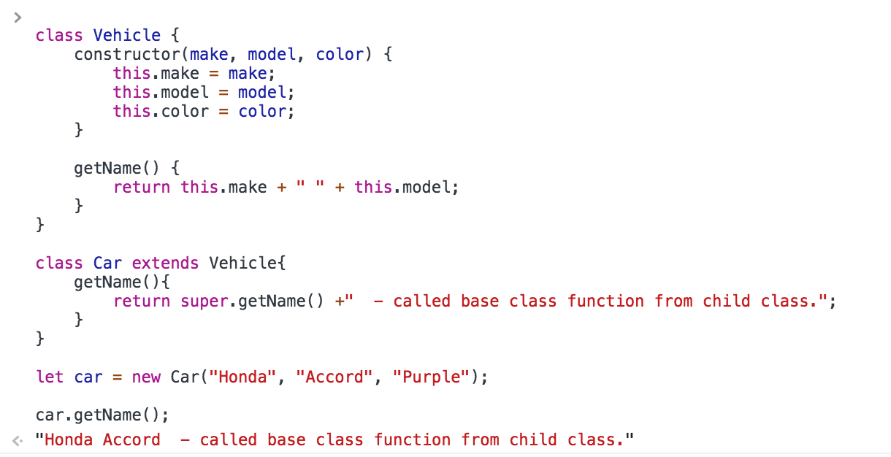

# Javascript avanzado

* AJAX
* Promesas
* Clases

AJAX  

Using promises  

Creating promises  

JS classes  

## Retos

### 1.- AJAX & json

Usar el proyecto base "retos-js-advanced/1-js-advanced" y modifícalo con el objetivo
de que el contenido que se carga dinámicamente pueda ser cargado desde un
archivo "json" que se encuentre accesible en la red.

[ver respuesta ->](./respuestas/js-advanced/1-js-advanced.md)

### 2.- AJAX & Promesas

Convertir el ejercicio pasado en una función que permita usar "Promises"

[ver respuesta ->](./respuestas/js-advanced/2-js-advanced.md)

### 3.- AJAX & Clases

Usando el ejercicio anterior crear una clase con su constructor y propiedades
para crear un "modelo" de lo que se espera recibir del AJAX y que actualice el
html.

[ver respuesta ->](./respuestas/js-advanced/3-js-advanced.md)

### Extras

* [Gestión de memoria](https://developer.mozilla.org/en-US/docs/Web/JavaScript/Gestion_de_Memoria)
* [Iteradores y generadores](https://developer.mozilla.org/en-US/docs/Web/JavaScript/Guide/Iterators_and_generators)
* [Meta programación](https://developer.mozilla.org/en-US/docs/Web/JavaScript/Guide/Meta_programming)
* [Módulos de javascript](https://developer.mozilla.org/en-US/docs/Web/JavaScript/Guide/Modules)

[<- README](./README.md)
