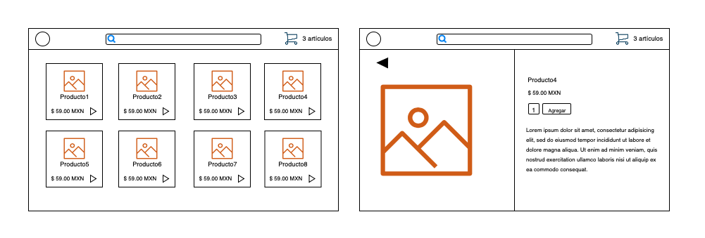

# Bloque 2

## Angular

### Objetivo
Crear dos pantallas funcionales con información estática.

Pantalla 1: Inicio - se debe mostrar un "header" con un logo, una barra para buscar y un botón para abrir el carrito, deberá tener una lista de productos donde cada producto dirige a una ruta nueva con un id del producto.

Pantalla 2: Producto: - se debe mostrar la información del producto de acuerdo al id de la ruta del producto. Se podrá agregar el producto a un carrito.

## Video 7

* Angular 101 [->](./angular-101.md)  
* Angular CLI [->](./angular-cli.md)
* Angular material [->](./angular-material.md)
* Typescript [->](./typescript.md)

## Video 8

* Sass [->](./sass.md)
* Data binding [->](./data-binding.md)
* Ng Built-in directives & pipes [->](./ng-built-in-directives-pipes.md)
