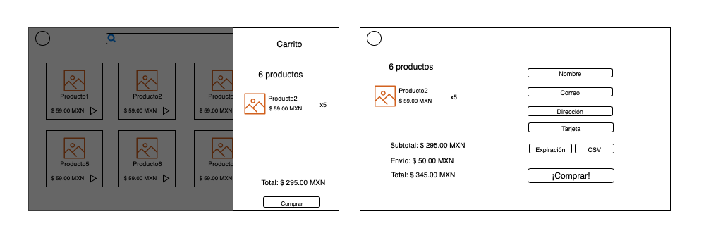

# Bloque 2

## Angular

### Objetivo
Crear cuatro pantallas funcionales con información estática.

Pantalla 1: Inicio - se debe mostrar un "header" con un logo, una barra para buscar y un botón para abrir el carrito, deberá tener una lista de productos donde cada producto dirige a una ruta nueva con un id del producto.

Pantalla 2: Producto: - se debe mostrar la información del producto de acuerdo al id de la ruta del producto. Se podrá agregar el producto a un carrito.

Pantalla 3: Carrito - se debe mostrar un menú lateral donde se muestre una lista de los productos seleccionados y la cantidad total. También deberá mostrar el costo total y un botón que envíe a la página de "checkout".

Pantalla 4: Checkout: - se mostrará el carrito así como el costo de envío y el total final, deberá tener una forma para llenar la información del usuario, al realizar la compra deberá mostrar un mensaje de confirmación.

## Video 7

* Angular 101 [->](./angular-101.md)  
* Angular CLI [->](./angular-cli.md)
* Angular material [->](./angular-material.md)
* Typescript [->](./typescript.md)

## Video 8

* Sass [->](./sass.md)
* Data binding [->](./data-binding.md)
* Ng Built-in directives & pipes [->](./ng-built-in-directives-pipes.md)

## Video 9

* Components [->](./components.md)
* Inputs & Outputs [->](./inputs-outputs.md)
